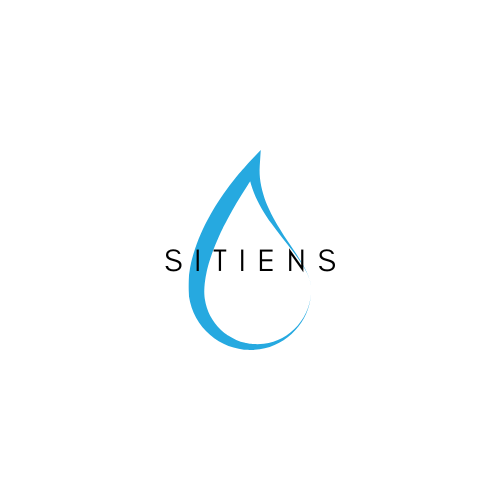

"<p align="center">
  
</p>


[](https://github.com/KMIOS91/SITIENS/actions/workflows/ci.yml)

# Sitiens
## Application iOS – Suivi de l'hydratation avec Xcode, Swift, SwiftUI & Core Data

---

## 📝 Description

**Sitiens** est une application iOS permettant de suivre et améliorer votre consommation quotidienne d’eau. Elle utilise **Swift**, **SwiftUI** pour l’interface utilisateur et **Core Data** pour stocker vos données localement sur l’appareil.

Ce projet met en pratique les compétences modernes en développement iOS, la gestion de données persistantes, et l’utilisation de Git/GitHub pour le versionnage du code.

---

## 🚀 Fonctionnalités

- Interface utilisateur fluide avec **SwiftUI**.
- Suivi journalier de l’hydratation.
- **Stockage local sécurisé avec Core Data**.
- Ajout rapide de verres d’eau.
- Visualisation des statistiques de consommation.
- Objectif d’hydratation quotidien configurable.
- Compatibilité avec le **mode clair/sombre**.
- Application 100 % offline (aucune connexion Internet requise).

---

## 🛠 Prérequis

- macOS avec Xcode (version récente).
- Connaissances de base en Swift, SwiftUI et Core Data.

---

## 🧪 Environnement recommandé

Utilisez **Xcode**, l’environnement officiel d’Apple pour créer, tester et déboguer des applications iOS. Core Data est nativement intégré à Xcode.

---

## ▶️ Utilisation

1. Clonez ce dépôt :
   ```bash
   git clone https://github.com/votre-utilisateur/sitiens.git
