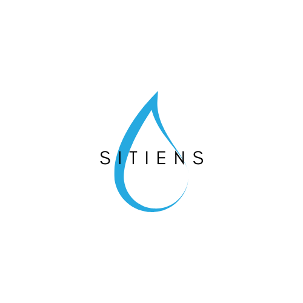

# 💧 Sitiens — Hydration Tracker

> Application iOS de suivi de l'hydratation, disponible sur l'App Store.

[](https://swift.org)
[](https://developer.apple.com/xcode/swiftui/)
[](https://developer.apple.com)
[](https://apps.apple.com/fr/app/sitiens/id6749267968)
[](https://github.com/Mody9156/SITIENS/actions/workflows/ci.yml)

---

## 📱 Aperçu

<!-- Ajoutez vos screenshots ici, exemple : -->
<!--   -->



---

## 📝 Description

**Sitiens** est une application iOS permettant de suivre et d'améliorer votre consommation quotidienne d'eau. Conçue avec **SwiftUI** et **Core Data**, elle fonctionne entièrement hors ligne et propose une expérience fluide et intuitive.

---

## ✨ Fonctionnalités

- 💧 Suivi journalier de la consommation d'eau
- 🎯 Objectif d'hydratation quotidien configurable
- 📊 Visualisation des statistiques de consommation
- 🔔 Notifications locales pour rappels d'hydratation
- 🌙 Support du mode clair / sombre
- 📴 100% offline — aucune connexion requise
- 📎 App Clip disponible pour un accès rapide

---

## 🛠 Stack technique

| Catégorie | Technologies |
|---|---|
| Langage | Swift 5.9 |
| UI | SwiftUI |
| Architecture | MVVM |
| Persistance | Core Data |
| Tests | XCTest (Unit + UI) |
| CI/CD | GitHub Actions |
| Distribution | TestFlight, App Store Connect |

---

## 🏗 Architecture

Le projet suit le pattern **MVVM** avec une séparation claire des responsabilités :

```
SITIENS/
├── Models/          # Entités Core Data & modèles métier
├── ViewModels/      # Logique métier & état de l'UI
├── Views/           # Composants SwiftUI
├── Services/        # Notifications, persistance
└── AppClip/         # Extension App Clip
```

---

## 🚀 Installation

1. Clonez le repo :
```bash
git clone https://github.com/Mody9156/SITIENS.git
```

2. Ouvrez le projet dans Xcode :
```bash
cd SITIENS
open SITIENS.xcodeproj
```

3. Sélectionnez un simulateur iOS 16+ et lancez avec `⌘R`

> Aucune dépendance externe — pas de SPM ni CocoaPods requis.

---

## 🧪 Tests

Le projet inclut des tests unitaires et UI :

```bash
# Via Xcode : Product > Test (⌘U)
```

---

## 📲 Télécharger

Disponible sur l'App Store :

[](https://apps.apple.com/fr/app/sitiens/id6749267968)

---

## 👤 Auteur

**Modibo Keïta** — Développeur iOS  
[GitHub](https://github.com/Mody9156) · [LinkedIn](https://www.linkedin.com/in/modibo-keita-337746278) · [App Store](https://apps.apple.com/fr/app/sitiens/id6749267968)
